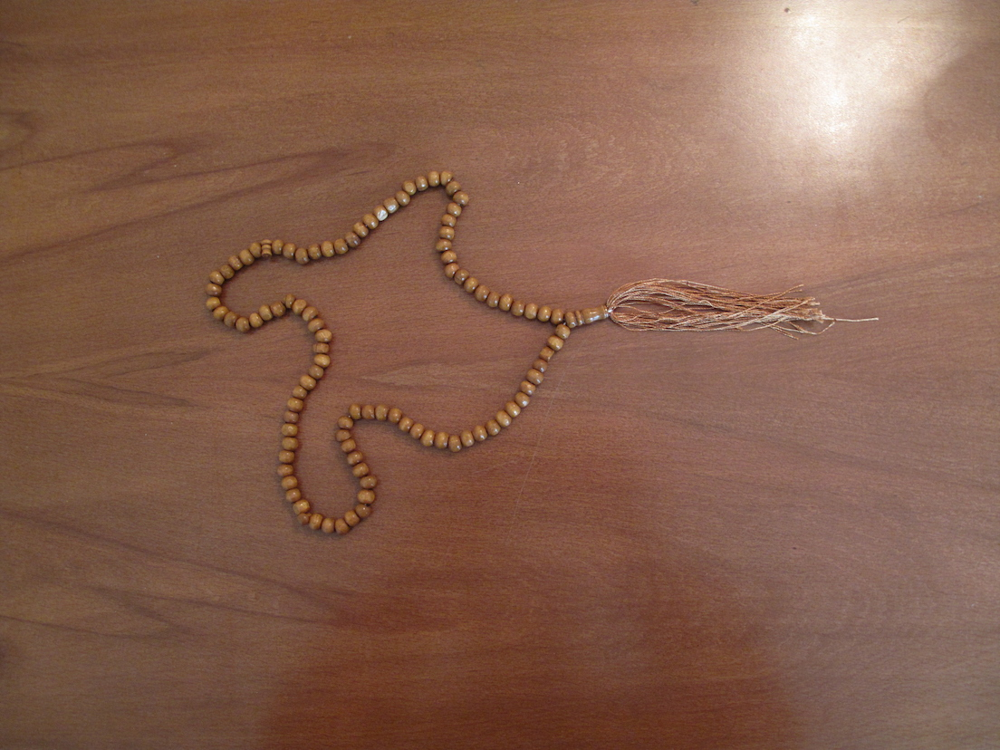
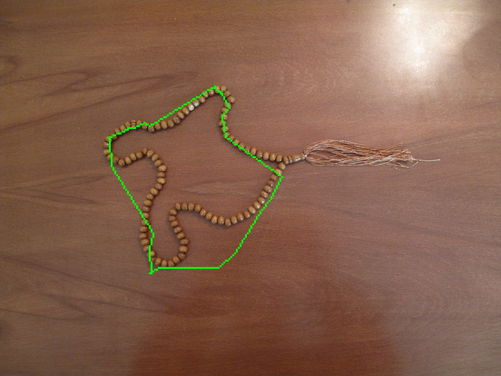

# Active-Contours-on-images
Active contour model, also called snakes, is a framework in computer vision introduced by Michael Kass, Andrew Witkin, and Demetri Terzopoulos for delineating an object outline from a possibly noisy 2D image. The snakes model is popular in computer vision, and snakes are widely used in applications like shape recognition, segmentation, edge detection and etc.

# Main Image

  

# Result

  

see "contour.mp4" for more detail of view
